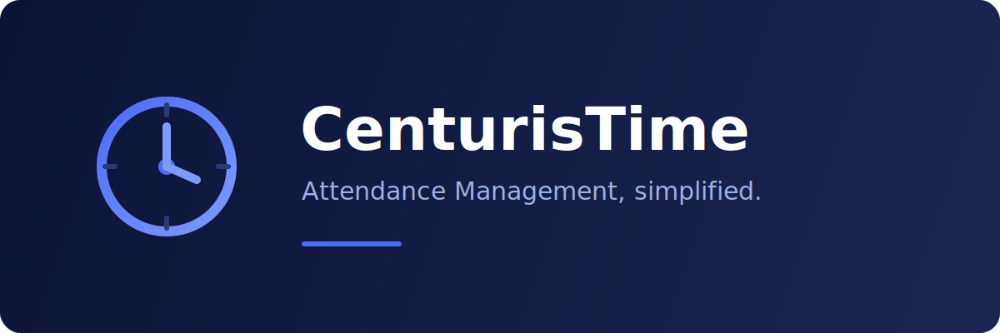

  

<h1 align="center">CenturisTime</h1>

<b>Attendance Management, simplified.</b>

  <a href="https://github.com/ahmed1coder/CenturisTime-releases/releases/latest">Download for Windows</a>
  ·
  <a href="#automatic-updates">Automatic updates</a>
  ·
  <a href="https://github.com/ahmed1coder/CenturisTime-releases/issues">Support &amp; Issues</a>

---

CenturisTime is a desktop application for pulling attendance logs and employee
data from compatible attendance devices on your local network, and keeping them
organized on your own machine. This repository hosts the **official releases**
and serves the **automatic-update feed** used by the in-app updater.

> CenturisTime is an independent, third-party product. It is **not** affiliated
> with, endorsed by, or a product of any attendance-hardware manufacturer.
> "Attendance device" refers to compatible punch-clock / biometric terminals
> that speak the standard TCP attendance protocol.

## Download

| Platform | Status | Installer |
| --- | --- | --- |
| Windows (x64) | ✅ Available | [`CenturisTime_x64-setup.exe`](https://github.com/ahmed1coder/CenturisTime-releases/releases/latest) |

1. Go to the [**latest release**](https://github.com/ahmed1coder/CenturisTime-releases/releases/latest).
2. Download `CenturisTime_x64-setup.exe` from the **Assets** section.
3. Run the installer and follow the prompts.

### About Windows SmartScreen

The installer is **not code-signed** with a paid Authenticode certificate yet, so
Windows may show:

> **Windows protected your PC** — Windows Defender SmartScreen prevented an
> unrecognized app from starting.

This is expected for independent software and is **not** a virus warning. To
continue:

1. On that dialog, click **More info**.
2. Click **Run anyway**.

Your data and device are unaffected — CenturisTime stores everything locally on
your machine.

## Features

- **Connect over LAN** — reach attendance devices on your network via the
  standard TCP attendance protocol (default port 4370), with resilient
  timeouts so the UI never hangs.
- **Pull attendance & users** — sync logs, employee records, and device info.
- **USB import** — import flash-drive exports (`attlog.dat`, `user.dat`) with
  automatic encoding (UTF-8 / Windows-1256) and delimiter detection.
- **Local-first storage** — an encrypted local SQLite database. Your data never
  leaves your machine.
- **Bilingual** — English and Arabic, with a persisted locale preference.

## Automatic updates

CenturisTime can update itself. The in-app **Check for Updates** button fetches
`updates.json` from this repository's GitHub Pages site and downloads the new
installer automatically. No manual download required after the first install.

## License activation

On first launch, CenturisTime shows a **Hardware ID** for your machine. To
activate:

1. Open an [issue](https://github.com/ahmed1coder/CenturisTime-releases/issues)
   requesting a license, and include your Hardware ID.
2. You'll receive a `.lic` file.
3. Load it from **Settings → Load License** (or drag-and-drop the `.lic` file
   onto the startup screen).

Activation is tied to the machine's Hardware ID and is verified locally — no
online account required.

## Privacy

CenturisTime is local-first: attendance data is stored in an encrypted database
on your computer and is never uploaded. See the
[Privacy Policy](https://github.com/ahmed1coder/CenturisTime-releases/issues)
for full details (a copy of `privacy-policy.html` ships with the app).

## Support

Found a bug or need a license? Open an
[issue](https://github.com/ahmed1coder/CenturisTime-releases/issues) in this
repository.

## Disclaimer

CenturisTime is an independent project and is not affiliated with, endorsed by,
or sponsored by any attendance-hardware manufacturer. All trademarks are the
property of their respective owners.

---

© CenturisTime. All rights reserved.
